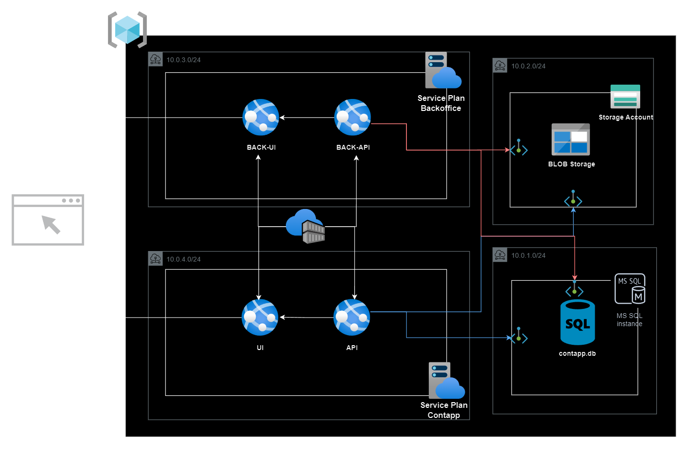

# Proyecto Terraform

Propuesta de implementación de arquitectura en **Azure** utilizando **Terraform**

## Diagrama

## Archivos de código (Terraform)
- **main.tf**: Se define el **Proveeder (Azure)** y el **grupo de recursos**.
- **network.tf**: Creación de una **Virtual Network** y **SubNets** dentro de la misma.
- **db.tf**: Conofiguración del **servidor de base de datos**, **Private Endpoint** y **DNS Zone**.
- **storage.tf**: Configuración del servicio de **BLOB Storage**.
- **webapp.tf**: Configuración de **Azure Container Registry**, **Service Plan** y las **Webapps**.
- **variables.tf**: Contiene todas las variables (agrupadas por tipos de servicios) que fueron parametrizadas para hacer el código más dinámico.
